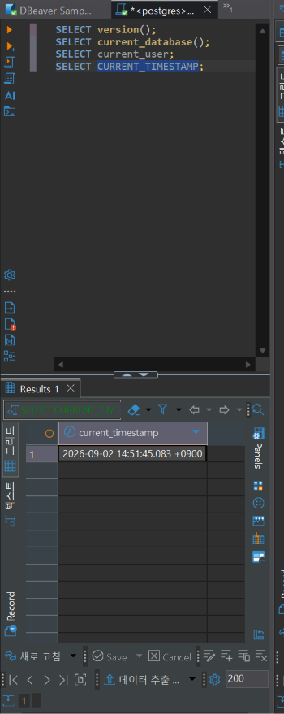
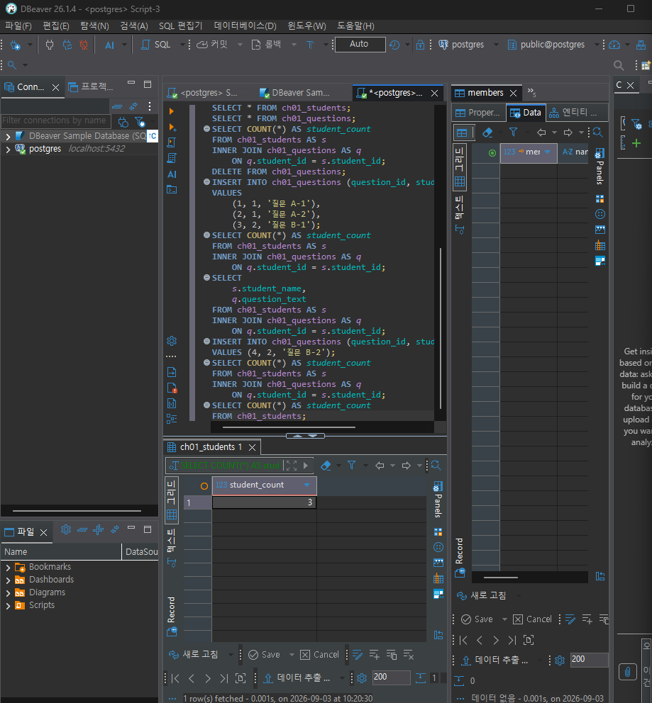
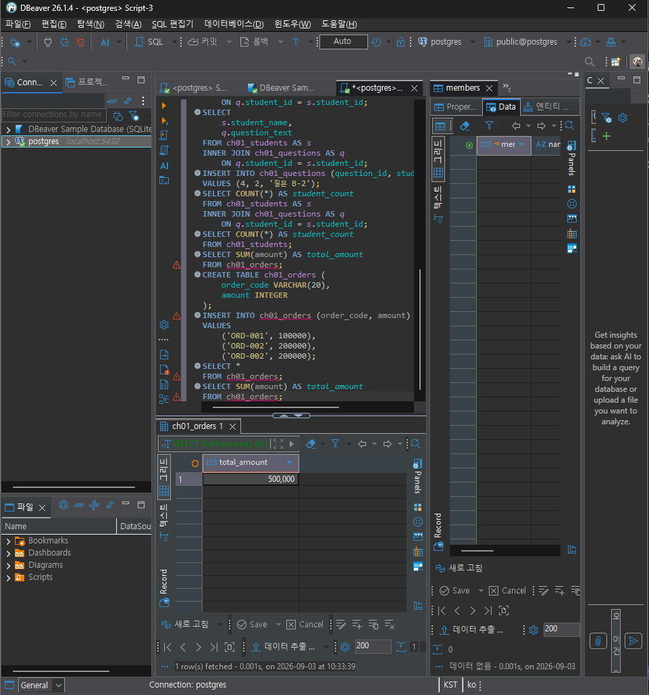
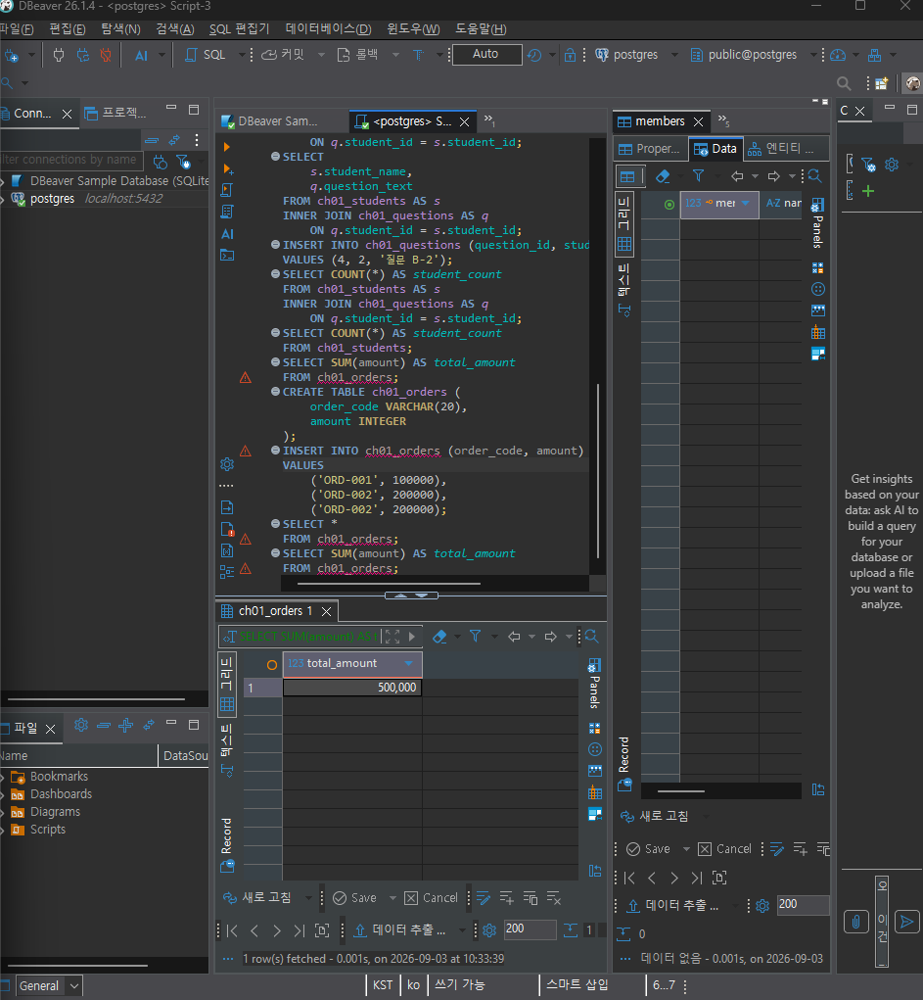

# Chapter 01 확장 실습 답안 템플릿

> **과제:** AI 시대에 데이터베이스를 왜 배워야 하는가  
> **사용 방법:** 이 파일을 내려받아 **본인의 GitHub 저장소**에 `chapter01_answer.md`라는 이름으로 저장한 뒤 답안을 작성합니다.  
> **제출 방법:** LMS에는 파일을 업로드하지 않고, **본인 GitHub 저장소의 `chapter01_answer.md` 파일 URL**을 제출합니다.

---

## 0. 학생 정보

| 항목 | 작성 내용 |
| --- | --- |
| 학번 |  |
| 이름 |황수아 |
| GitHub 계정 | totoriri605@gmail.com |
| 과제 작성일 |2026-09-02  |
| 사용한 AI 도구 | ChatGPT |

> 실제 비밀번호, API Key, 전체 DB 접속 URL, 개인정보는 이 파일이나 캡처 화면에 기록하지 않습니다.

---

# 1. PostgreSQL 실행 환경 확인

## 1-1. 실행한 SQL

```sql
SELECT version();
SELECT current_database();
SELECT current_user;
SELECT CURRENT_TIMESTAMP;
```

## 1-2. 실행 결과 기록

```text
PostgreSQL 버전: PostgreSQL 18.6
현재 데이터베이스: postgres
현재 사용자:postgres
현재 시각:2026-09-02 14:44:27.434 +0900
```

## 1-3. 내가 확인한 내용

1. SQL을 작성하는 프로그램과 PostgreSQL은 같은 프로그램인가요?

```text
나의 답:아니다. DBeaver는 SQL을 작성하고 결과를 확인하는 프로그램이고,
PostgreSQL은 데이터를 저장하고 SQL을 실제로 처리하는 DBMS이다.
```

2. `current_database()` 결과는 무엇을 의미하나요?

```text
나의 답:current_database()는 현재 연결해서 사용하고 있는 데이터베이스의 이름을 의미한다.
현재 실행 결과가 postgres이므로, 현재 사용 중인 데이터베이스는 postgres이다.
```

3. SQL이 실행되었다는 사실만으로 데이터 내용도 올바르다고 할 수 있나요?

```text
나의 답: 아니다. SQL이 오류 없이 실행되었더라도
원본 데이터가 잘못되어 있거나 잘못된 조건으로 조회했다면
결과가 정확하지 않을 수 있다.
따라서 실행 성공뿐만 아니라 결과가 맞는지도 확인해야 한다
```

## 1-4. 증거 화면

아래 경로에 캡처 이미지를 저장하는 것을 권장합니다.

```text
assignments/chapter01/images/step01_environment.png
```




# 2. Chapter 01 핵심 내용 복습

교재 문장을 그대로 복사하지 말고 자신의 말로 작성합니다.

| 본문의 핵심 | 나의 설명 |
| --- | --- |
| AI가 SQL을 만들어도 DB를 배워야 한다 |AI가 SQL을 만들어줘도 결과가 맞는지 판단하려면 데이터베이스의 기본 개념을 알아야 한다.|
| 데이터 구조가 중요하다 |데이터를 어떤 테이블과 항목으로 나누어 저장하느냐에 따라 조회와 관리 방법이 달라지기 때문이다.|
| SQL 결과를 검증해야 한다 |SQL이 오류 없이 실행되어도 내가 원하는 의미의 결과인지 직접 확인해야 한다.|
| 데이터 품질이 AI 답변 품질에 영향을 준다 |원본 데이터에 중복이나 오류가 있으면 AI도 잘못된 데이터를 기준으로 답할 수 있다.|
| 저장 방식은 데이터 양만 보고 선택하지 않는다 |데이터 양뿐 아니라 사용자 수, 데이터 관계, 정확성, 권한 관리 등을 함께 고려해야 한다.|

## 가장 중요하다고 생각한 한 문장

```AI가 SQL을 만들어 줄 수 있어도 그 결과가 맞는지 판단하고 검증하려면
데이터베이스의 기본 개념을 알아야 한다.

```

---

# 3. 실행 성공과 결과 정확성의 차이

## 3-1. SQL 실행 전 예상

학생 A는 질문 2개, 학생 B는 질문 1개, 학생 C는 질문이 없습니다.

```text
전체 학생 수: 3명 
전체 질문 수: 3개
질문이 있는 학생 수: 2명
질문이 없는 학생 수: 1명
```

## 3-2. 임시 테이블 생성 및 데이터 입력 완료 확인

- [ ] `ch01_students` 생성
- [ ] `ch01_questions` 생성
- [ ] 학생 3명 입력
- [ ] 질문 3건 입력
- [ ] 두 테이블의 데이터를 직접 조회

## 3-3. 잘못된 학생 수 SQL 실행 결과

실행한 SQL:

```sql
SELECT COUNT(*) AS student_count
FROM ch01_students AS s
INNER JOIN ch01_questions AS q
    ON q.student_id = s.student_id;
```

실행 결과:3

```3

```

## 3-4. JOIN 상세 결과 관찰

```text
학생 A가 나타난 행 수:2행
학생 B가 나타난 행 수:1행
학생 C가 나타난 행 수:0행
```

다음 질문에 답합니다.

### Q1. 학생 C가 왜 결과에서 사라졌나요?

```
학생 C는 질문 데이터가 없기 때문에 INNER JOIN에서 연결되는 행이 없어 결과에서 제외되었습니다.
```
### Q2. 학생 A가 왜 여러 행으로 나타났나요?

```
학생 A는 질문을 2개 작성했기 때문에 JOIN 과정에서 각 질문과 연결되어 2개의 행으로 나타났습니다.
```

### Q3. 위 `COUNT(*)`가 실제로 세고 있었던 것은 무엇인가요?

```
COUNT(*)는 실제 학생 수가 아니라 INNER JOIN 후 만들어진 결과 행의 개수를 세고 있었습니다.
```

### Q4. 결과 숫자가 우연히 실제 학생 수와 같아도 바로 믿으면 안 되는 이유는 무엇인가요?

```실행 결과가 예상한 숫자와 같다고 해서 SQL의 의미까지 올바른 것은 아닙니다.
이번 결과는 JOIN 후 행 수와 실제 학생 수가 우연히 같았기 때문에,
어떤 데이터를 세고 있는지 직접 확인해야 합니다.

```

## 3-5. 질문 한 건을 추가한 뒤 다시 실행

추가한 데이터: 학생 B(student_id=2)의 질문 B-2를 1건 추가했습니다.

```text

```

다시 실행한 결과:4

```text
AI SQL 결과:4
실제 학생 수:3
```

### 결과 해석

```text
데이터가 바뀐 뒤 무엇이 달라졌는지:학생 B의 질문이 1건 추가되면서 JOIN 결과의 행 수가 3개에서 4개로 늘어났습니다.

실제 학생 수는 왜 그대로인지:질문 데이터만 추가되었고 새로운 학생은 추가되지 않았기 때문에 실제 학생 수는 여전히 3명입니다.

이 실험을 통해 알게 된 점:COUNT(*)는 실제 학생 수가 아니라 JOIN 후 만들어진 결과 행의 수를 셀 수 있다는 것을 알게 되었습니다.
따라서 SQL이 정상 실행되고 결과 숫자가 나와도, 그 숫자가 실제로 무엇을 의미하는지 확인해야 합니다.
```

## 3-6. 학생 테이블을 직접 센 결과

```sql
SELECT COUNT(*) AS student_count
FROM ch01_students;
```

결과:

```
3
```

### 두 SQL의 차이를 내 말로 설명

```text
첫 번째 SQL은 INNER JOIN 후 만들어진 결과 행의 수을 세고 있었다.

두 번째 SQL은 학생 테이블에 저장된 학생 행의 수을 세고 있었다.

따라서 SQL을 검토할 때는 문법보다 먼저
무엇을 기준으로 어떤 데이터를 세고 있는지을 확인해야 한다.
```

## 3-7. 증거 화면

권장 경로:

```text
assignments/chapter01/images/step03_join_result.png
```

`여기에 STEP 3 핵심 증거 화면을 삽입하세요.`



# 4. 잘못된 데이터가 결과를 바꾸는 과정

## 4-1. 주문 데이터 확인

다음 데이터를 입력한 뒤 실제 결과를 확인합니다.

```text
ORD-001, 100000
ORD-002, 200000
ORD-002, 200000
```

## 4-2. 실행 전 예상

업무적으로 주문이 `ORD-001`, `ORD-002` 두 건이고 `order_code`가 주문을 고유하게 구분한다고 **가정할 경우** 예상 합계:

```text
300000원
```

> 위 가정 자체가 실제 업무 규칙인지 확인해야 한다는 점도 기억합니다.

## 4-3. SQL 합계

```sql
SELECT SUM(amount) AS total_amount
FROM ch01_orders;
```

실제 결과:

```text
500,000원
```

## 4-4. 결과 해석

### `SUM` 문법 자체가 잘못된 것인가요?

```
아니다. SUM 함수는 amount에 저장된 값을 모두 더해서 500000원을 정확하게 계산했다.
```

### 결과 차이의 원인은 무엇인가요?

```
ORD-002 데이터가 중복으로 입력되어 있어서 같은 주문 금액이 두 번 더해졌기 때문이다.
```

### SQL이 정확하게 실행되어도 업무 숫자가 잘못될 수 있는 이유를 설명하세요.

```SQL 문법이 정확하더라도 원본 데이터에 중복이나 잘못된 값이 있으면
그 데이터를 기준으로 계산하기 때문에 실제 업무에서 기대하는 숫자와 다른 결과가 나올 수 있다.
```

## 4-5. AI에게 같은 데이터를 분석시킨 결과

AI가 계산한 합계:


```
500000원
```

AI가 중복 가능성을 언급했나요?

```
네. ORD-002가 두 번 나타나기 때문에 중복 데이터일 가능성이 있다고 언급했다.
```

AI가 `ORD-002` 두 행이 실제 두 주문인지 중복 입력인지 스스로 확정할 수 있나요? 이유도 적으세요.

```아니다. 데이터만 보고는 두 행이 실제로 서로 다른 주문인지,
실수로 중복 입력된 것인지 확정할 수 없다.
업무 규칙이나 원본 주문 기록을 추가로 확인해야 한다.
```

추가로 확인해야 할 업무 규칙:

```text
1. order_code는 주문 한 건마다 반드시 고유한 값인지 확인한다.
2. 같은 order_code가 여러 번 저장될 수 있는 경우가 있는지 확인한다.
3. 중복 주문이 발견되었을 때 어떤 기준으로 정상 데이터와 중복 데이터를 구분하는지 확인한다.
```

내가 최종적으로 내린 판단:

```현재 데이터만 보면 합계는 500000원이지만,
ORD-002가 중복 입력된 데이터라면 실제 업무상 합계는 300000원일 수 있다.
따라서 원본 주문 기록과 업무 규칙을 확인한 뒤 최종 금액을 판단해야 한다.
```

## 4-6. 증거 화면

권장 경로:

```text
assignments/chapter01/images/step04_duplicate_result.png
```

`

---

# 5. 파일·스프레드시트·DBMS 선택 연습

각 사례에 대해 **AI에게 묻기 전에 먼저 본인의 판단을 작성**합니다.

## 사례 A. 개인 독서 기록

```text
나의 선택:일반 파일
선택 이유:혼자 사용하는 개인 독서 기록이고 데이터 구조가 단순하기 때문에
간단한 파일로도 충분히 기록하고 관리할 수 있다고 생각했다.
어떤 조건이 추가되면 다른 방식으로 바꿀 것인지:책이 많아져서 검색이나 정렬, 통계를 자주 해야 한다면
스프레드시트나 DBMS 사용을 고려할 것이다.
```

## 사례 B. 동아리 행사 신청 명단

```text
나의 선택: 스프레드시트

선택 이유:
신청자 정보를 표 형태로 정리하기 쉽고,
정렬이나 필터링을 이용해 신청 현황을 간단하게 관리할 수 있기 때문이다.

어떤 조건이 추가되면 다른 방식으로 바꿀 것인지:
신청자가 많아지고 여러 사람이 동시에 데이터를 수정하거나,
행사·회원·결제 정보처럼 서로 연결된 데이터를 계속 관리해야 한다면
DBMS 사용을 고려할 것이다.
```

## 사례 C. 온라인 강의 서비스

```text
나의 선택:DBMS
선택 이유:
온라인 강의 서비스는 회원, 강의, 수강 신청, 과제, 성적 등
서로 관계가 있는 데이터를 지속적으로 관리해야 하고
여러 사용자가 동시에 서비스를 이용하기 때문에 DBMS가 적합하다.

어떤 조건이 추가되면 다른 방식으로 바꿀 것인지:
개인 혼자 사용하는 단순한 강의 기록이고
데이터 사이의 관계나 반복적인 조회가 거의 없다면
스프레드시트로 관리하는 것도 고려할 수 있다.
```

## 판단 기준 체크

- [ ] 데이터 증가
- [ ] 여러 사용자의 동시 수정
- [ ] 데이터 사이의 관계
- [ ] 반복 조회와 집계
- [ ] 정확성·일관성
- [ ] 변경 이력
- [ ] 권한 구분
- [ ] 백업·복구
- [ ] 웹·앱에서 지속 사용

### 데이터가 적으면 무조건 스프레드시트를 사용해야 하나요?

```text
나의 답:아니다. 데이터가 적더라도 여러 사용자가 동시에 수정하거나,
데이터 사이의 관계가 복잡하고 정확성이나 권한 관리가 중요하다면
DBMS를 사용하는 것이 더 적절할 수 있다.
따라서 데이터의 양만으로 저장 방식을 결정하면 안 된다.
```

---

# 6. 나만의 서비스 데이터 구조 초안

> 이 내용은 이후 Chapter에서 계속 확장할 수 있으므로 신중하게 작성합니다.

## 6-1. 서비스 정의

```text
서비스 이름: PMU 고객관리 서비스

이 서비스는
반영구 시술 고객의 기본 정보, 시술 기록, 리터치 여부, 메모 등을
체계적으로 저장하고 관리하기 위한 서비스이다.
```

## 6-2. 관리할 데이터 후보

```text
1. 고객 정보
2. 시술 기록
3. 리터치 기록
4. 시술 메모
5. 시술 사진
```

## 6-3. 한 행의 의미

| 데이터 후보 | 한 행의 의미 |
| --- | --- |
| 고객 정보 | 고객 1명의 기본 정보를 의미한다. |
| 시술 기록 | 고객에게 진행한 시술 1회를 의미한다. |
| 리터치 기록 | 고객에게 진행한 리터치 1회를 의미한다. |

## 6-4. 관계를 자연어로 설명

```text
1. 한 명의 고객은 여러 번의 시술 기록을 가질 수 있다.
2. 하나의 시술 기록에는 리터치 기록이 연결될 수 있다.
3. 한 명의 고객은 여러 개의 시술 메모와 시술 사진을 가질 수 있다.
```

## 6-5. 아직 결정하지 않은 정책

```text
Q1. 고객 1명당 시술 사진은 몇 장까지 저장할 것인가?
Q2. 리터치는 시술 후 몇 주 이내까지 리터치로 인정할 것인가?
Q3. 고객이 여러 종류의 시술을 받은 경우 시술별로 메모를 따로 관리할 것인가?
```

> 확정되지 않은 정책을 AI가 임의로 결정한 경우 그대로 받아들이지 않습니다.

---

# 7. AI를 검토자로 활용하기

## 7-1. 내가 AI에게 전달한 핵심 프롬프트

개인정보나 비밀번호 등 민감한 내용은 제거한 뒤 기록합니다.

```PMU 고객관리 서비스를 만들려고 한다.
고객 정보, 시술 기록, 리터치 기록, 시술 메모, 시술 사진을 관리하려고 하는데
데이터 구조를 어떻게 나누면 좋을지 검토해줘.
다만 아직 정하지 않은 정책은 임의로 확정하지 말고 질문 형태로 알려줘.

```

## 7-2. AI의 주요 제안과 나의 판단

최소 5개를 작성합니다.

| AI의 제안 | 수용 / 수정 / 거절 | 나의 판단 근거 |
| --- | --- | --- |
| 고객 정보와 시술 기록을 별도 테이블로 나누기 | 수용 | 한 명의 고객이 여러 번 시술받을 수 있기 때문이다. |
| 리터치 기록을 별도로 관리하기 | 수용 | 일반 시술과 리터치를 구분해서 확인하기 쉽기 때문이다. |
| 시술 사진을 별도 데이터로 관리하기 | 수용 | 한 시술에 여러 장의 사진이 연결될 수 있기 때문이다. |
| 고객마다 리터치는 반드시 1회만 가능하도록 제한하기 | 거절 | 실제 운영 정책이 아직 정해지지 않았기 때문이다. |
| 시술 메모를 고객 정보에 한 번만 저장하기 | 수정 | 고객 전체 메모와 시술별 메모를 구분하는 것이 더 좋다고 판단했다. |

## 7-3. AI에게 자기 답변을 다시 비판하도록 요청한 결과

첫 번째 답변과 달라진 점:

```처음에는 AI가 일부 운영 정책을 일반적인 방식으로 가정했지만,
다시 검토한 뒤에는 확정되지 않은 정책은 질문으로 남겨야 한다는 점을 추가했다.


```

AI가 처음에 임의로 가정했던 내용:

```
리터치 횟수, 사진 저장 개수, 시술별 메모 관리 방식 등을 일반적인 기준으로 가정했다.
```

추가로 업무 담당자에게 확인해야 한다고 판단한 내용:

```
리터치 인정 기간, 사진 보관 기준, 고객 개인정보 보관 기간 등을 확인해야 한다고 판단했다.
```

## 7-4. AI 활용에 대한 나의 평가

```text
가장 유용했던 부분:고객 정보와 시술 기록을 분리해서 관리해야 한다는 점을 알게 된 것.

수정하거나 거절한 부분:리터치 횟수나 사진 저장 개수처럼 실제 운영 정책이 정해지지 않은 부분.

그렇게 판단한 근거:AI가 일반적인 기준을 제안할 수는 있지만 실제 서비스 운영 규칙은 사람이 정해야 하기 때문이다.

AI가 없었다면 놓쳤을 가능성이 있는 질문:시술 사진을 고객 단위로 저장할지 시술 단위로 저장할지에 대한 질문.
```

## 7-5. AI 활용 증거 화면

권장 경로:

```text
assignments/chapter01/images/step07_ai_review.png
```

AI 대화 전체를 캡처할 필요는 없습니다. 핵심 요청과 검토 과정이 보이는 화면 1장 정도면 충분합니다.

`여기에 AI 활용 증거 화면을 삽입하세요.`



# 8. 기준 데이터·파생 데이터·AI 생성 결과 구분

내 서비스에 맞게 작성합니다.

| 구분 | 내 서비스의 예 | 판단 이유 |
| --- | --- | --- |
| 기준 데이터 |고객 정보, 시술 날짜, 시술 종류, 리터치 기록  | 실제 고객과 시술 과정에서 직접 입력하여 저장하는 원본 데이터이기 때문이다. |
| 파생 데이터 | 고객별 시술 횟수, 최근 방문일, 리터치 예정 여부 |저장된 고객 정보와 시술 기록을 조회하거나 계산해서 만들어지는 데이터이기 때문이다|
| AI 생성 결과 | 고객 재방문 브리핑, 시술 기록 요약 | 저장된 데이터를 바탕으로 AI가 분석하거나 새롭게 만들어 낸 결과이기 때문이다. |

### 기준 데이터가 변경되면 파생 데이터는 어떻게 해야 하나요?

```기준 데이터가 변경되면 그 데이터를 이용해서 만든 파생 데이터도
다시 계산하거나 업데이트해야 한다.

예를 들어 새로운 시술 기록이 추가되면
고객의 총 시술 횟수와 최근 방문일도 함께 변경되어야 한다.
```

### AI 결과만 있고 원본 데이터가 없다면 결과를 충분히 검증할 수 있나요?

```아니다.

AI 결과만 있고 원본 데이터가 없다면
AI가 어떤 데이터를 기준으로 결과를 만들었는지 확인하기 어렵다.

따라서 AI의 결과가 정확한지 검증하려면
원본 데이터도 함께 확인할 수 있어야 한다.
```

---

# 9. 최종 성찰

아래 세 문장은 반드시 **본인의 말**로 작성합니다.

```text
1. SQL이 실행되어도 결과를 바로 믿으면 안 되는 이유는

   SQL이 오류 없이 실행되어도 원본 데이터가 중복되거나 잘못되어 있으면
   실제로 원하는 결과와 다른 값이 나올 수 있기 때문이다.

2. AI를 데이터베이스 학습에 활용할 때 가장 중요한 것은

   AI가 알려준 답을 그대로 믿는 것이 아니라
   직접 SQL을 실행하고 결과가 맞는지 확인하는 것이다.

3. 이번 실습 이후 내가 더 확인하고 싶은 것은

   실제 서비스에서는 중복 데이터가 들어가지 않도록 데이터베이스를 어떻게 설계하는지 알아보는 것이다.
```

## 이번 Chapter에서 새롭게 알게 된 점 3가지

```text
1. INNER JOIN을 사용하면 서로 연결되는 데이터만 결과에 나타난다는 것을 알게 되었다.
2. COUNT(*)는 내가 생각한 사람 수가 아니라 JOIN 후 만들어진 행의 수를 셀 수도 있다는 것을 알게 되었다.
3. SQL이나 AI가 계산을 정확하게 해도 원본 데이터에 문제가 있으면 결과도 잘못될 수 있다는 것을 알게 되었다.
```

## 아직 이해가 명확하지 않은 부분

```text
1. INNER JOIN 외에 다른 JOIN은 각각 언제 사용하는지 아직 명확하지 않다.
2. 실제 서비스에서 중복 데이터를 막기 위해 테이블을 어떻게 설계하는지 더 공부하고 싶다.
```

---

# 10. 제출 전 자기 점검

- [ ] PostgreSQL 실행 화면을 확인했다.
- [ ] SQL 실행 전에 예상 결과를 먼저 작성했다.
- [ ] `INNER JOIN` 예제에서 누락과 반복을 설명할 수 있다.
- [ ] 숫자가 우연히 같아도 의미가 다를 수 있음을 설명했다.
- [ ] 중복 데이터가 집계 결과에 미치는 영향을 확인했다.
- [ ] 저장 방식을 데이터 양만으로 판단하지 않았다.
- [ ] 개인 서비스 주제를 하나 정했다.
- [ ] 데이터 후보와 한 행의 의미를 작성했다.
- [ ] 미확정 정책을 최소 3개 작성했다.
- [ ] AI 제안을 수용·수정·거절로 구분했다.
- [ ] AI 제안에 대한 판단 근거를 작성했다.
- [ ] 기준 데이터·파생 데이터·AI 결과를 구분했다.
- [ ] 핵심 증거 이미지가 Markdown에서 정상적으로 보인다.
- [ ] 비밀번호·API Key·개인정보가 노출되지 않았다.

---

# 11. LMS 제출 정보

## 내 GitHub 답안 파일 URL

아래에는 **교수자 템플릿 URL이 아니라 본인이 작성한 답안 파일의 GitHub URL**을 기록합니다.

```text
https://github.com/<본인-GitHub-ID>/<본인-저장소>/blob/main/assignments/chapter01/chapter01_answer.md
```

내 실제 제출 URL:

```text

```

> LMS에는 위 **본인 저장소의 `chapter01_answer.md` 파일 URL 하나**를 제출합니다.

---

## 권장 학생 저장소 구조

```text
<본인-저장소>/
└── assignments/
    └── chapter01/
        ├── chapter01_answer.md
        └── images/
            ├── step01_environment.png
            ├── step03_join_result.png
            ├── step04_duplicate_result.png
            └── step07_ai_review.png
```

이 구조를 사용하면 이후 Chapter 02, Chapter 03도 같은 방식으로 계속 추가할 수 있습니다.
