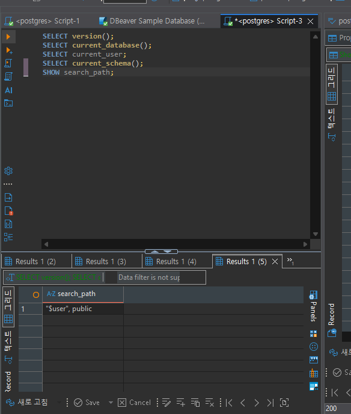
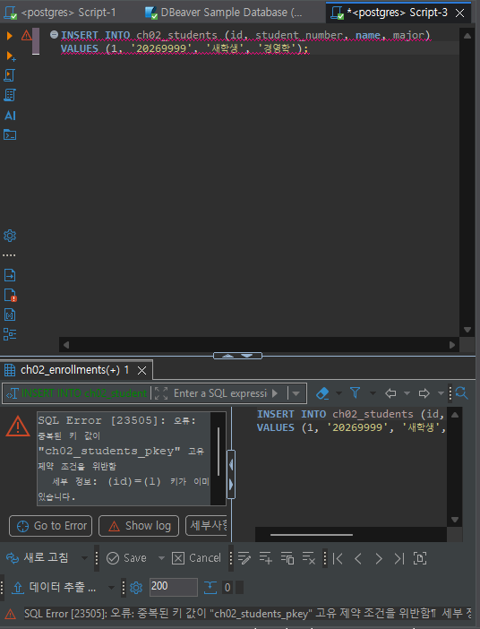

# Chapter 02 확장 실습 답안 템플릿

> **과제:** 데이터와 DBMS의 기본 개념  
> **사용 방법:** 이 파일을 내려받아 본인의 GitHub 저장소에 `chapter02_answer.md`라는 이름으로 저장한 뒤 실습하면서 바로 작성합니다.  
> **제출 방법:** LMS에는 파일을 직접 업로드하지 않고, **본인 GitHub 저장소의 `chapter02_answer.md` 파일 URL**을 제출합니다.

---

## 제출 전 개인정보 주의

LMS에서 제출자를 확인할 수 있으므로 이 공개 Markdown 파일에 학번이나 실명을 반드시 적을 필요는 없습니다.

```text
GitHub 계정 또는 별칭:
과제 작성일:
사용한 AI 도구:
```

> 실제 비밀번호, API Key, 전체 DB 접속 URL, 개인정보가 포함된 화면은 올리지 않습니다.

---

# 1. PostgreSQL에서 현재 위치 확인

## 1-1. 실행한 SQL

```sql
SELECT version();
SELECT current_database();
SELECT current_user;
SELECT current_schema();
SHOW search_path;
```

## 1-2. 실행 결과 기록

```text
PostgreSQL 버전: 18.6
현재 데이터베이스:postgres
현재 사용자:postgres
현재 스키마:public
search_path:"$user", public
```

## 1-3. 구조를 내 말로 설명

```text
PostgreSQL은:
데이터베이스를 관리하고 SQL을 실행하는 DBMS이다.
현재 접속한 데이터베이스는:
PostgreSQL DBMS가 관리하는 여러 데이터베이스 중 현재 내가 연결해서 사용 중인 데이터베이스이다.
스키마는:
데이터베이스 안에서 테이블 같은 객체들을 구분하고 정리하는 공간이다.
DBeaver 또는 psql 같은 도구는:
사용자가 PostgreSQL에 접속해서 SQL을 작성하고 실행할 수 있게 해주는 클라이언트 도구이다.
```

## 1-4. 계층 구조 완성

```text
사용자
→ DBeaver / psql 같은 클라이언트
→ PostgreSQL DBMS
→ 데이터베이스
→ 스키마
→ 테이블
→ 행 / 열
```

## 1-5. 증거 화면

권장 경로:

```text
assignments/chapter02/images/step01_environment.png
```



```

# 2. 데이터베이스 안의 스키마와 테이블 관찰

## 2-1. 스키마 조회 결과

실행한 SQL:

```sql
SELECT schema_name
FROM information_schema.schemata
ORDER BY schema_name;
```

관찰한 스키마 이름 중 3개 이내를 적습니다.

```text
1.information_schema
2.pg_catalog
3.pg_toast
```

### `public`은 무엇인가요?

```text
나의 설명:public은 현재 데이터베이스 안에 있는 스키마 중 하나이다.
테이블 같은 데이터베이스 객체를 구분하고 정리하는 공간이다.
```

### 데이터베이스와 스키마는 같은 것인가요?

```text
나의 설명:아니다.
데이터베이스 안에는 여러 개의 스키마가 존재할 수 있다.
데이터베이스가 더 큰 공간이고, 스키마는 그 안에서
테이블 같은 객체를 나누어 관리하는 공간이다.
```

## 2-2. 현재 보이는 테이블 조회

```sql
SELECT table_schema, table_name
FROM information_schema.tables
WHERE table_type = 'BASE TABLE'
  AND table_schema NOT IN ('pg_catalog', 'information_schema')
ORDER BY table_schema, table_name;
```

```text
조회된 사용자 테이블 수 또는 눈에 띈 테이블:

아직 테이블이 거의 없어도 괜찮은 이유:
```

## 2-3. 관찰 정리

```text
PostgreSQL 서버 안에는 여러 데이터베이스가 있을 수 있다.
한 데이터베이스 안에는 여러 스키마가 있을 수 있다.
스키마 안에는 테이블과 같은 객체가 존재한다.
```

---

# 3. TEMP TABLE로 테이블·행·열·키 직접 확인

## 3-1. 임시 테이블 생성 완료 확인

- [ ] `ch02_students` 생성
- [ ] `ch02_courses` 생성
- [ ] `ch02_enrollments` 생성

각 테이블의 **한 행 의미**를 적습니다.

| 테이블 | 한 행의 의미 |
| --- | --- |
| `ch02_students` | 학생 한 명 |
| `ch02_courses` |강의 한 개|
| `ch02_enrollments` |특정 학생이 특정 강의를 신청한 기록 한 건|

## 3-2. 열의 의미 확인

### `ch02_students`

| 열 | 값의 의미 | 내부 식별자 / 업무 식별자 / 일반 속성 |
| --- | --- | --- |
| `id` |DB 내부에서 학생 한 명을 구분하는 번호  |내부 식별자|
| `student_number` |학교에서 사용하는 학번|업무 식별자|
| `name` |학생 이름|일반 속성|
| `major` |학생 전공|일반 속성|

### `ch02_enrollments`

| 열 | 값의 의미 | PK / FK / 일반 속성 |
| --- | --- | --- |
| `id` |수강신청 한 건을 구분하는 번호|PK|
| `student_id` |어떤 학생의 신청인지 연결하는 값|FK|
| `course_id` |어떤 강의를 신청했는지 연결하는 값|FK|
| `status` |  |신청, 수강중, 완료 같은 상태|일반 속상

## 3-3. 입력된 행 수

```text
students 행 수: 3
courses 행 수:아직 데이터 입력 전
enrollments 행 수:아직 데이터 입력 전
```

## 3-4. 내부 식별자와 업무 식별자

```text
students.id가 필요한 이유:데이터베이스 내부에서 학생 한 명의 행을 안정적으로 구분하기 위해 필요하다.

student_number가 필요한 이유:학교 업무에서 학생을 구분할 때 사용하는 실제 학번을 저장하기 위해 필요하다.

둘을 항상 같은 값으로 사용하지 않아도 되는 이유:id는 데이터베이스 내부에서 사용하는 식별자이고,
student_number는 학교 업무에서 사용하는 식별자라서 역할이 다르기 때문이다.
학번 체계가 변경되더라도 내부 id는 그대로 유지할 수 있다.
```

## 3-5. 숫자처럼 보이는 학번을 문자열로 저장한 이유

```text
나의 설명:학번은 계산하기 위한 숫자가 아니라 학생을 구분하기 위한 식별값이다.
숫자로 저장하면 00123456의 앞자리 0이 사라질 수 있기 때문에
앞자리 0을 그대로 보존할 수 있도록 문자열로 저장한다.
```

---

# 4. 테이블과 조회 결과는 다르다

## 4-1. 원본 테이블 행 수

```text
ch02_students 전체 행 수:3
```

## 4-2. 일부 열만 조회

실행 SQL:

```sql
SELECT name, major
FROM ch02_students
ORDER BY id;
```

```text
원본 테이블의 열 수와 조회 결과의 열 수가 다른 이유:SELECT 문에서 원본 테이블의 모든 열을 조회한 것이 아니라
name과 major 두 열만 선택해서 조회했기 때문이다.
원본 테이블의 열이 삭제된 것은 아니다
```

## 4-3. 조건을 적용한 조회

실행 SQL:

```sql
SELECT id, student_number, name, major
FROM ch02_students
WHERE major = '컴퓨터공학'
ORDER BY id;
```

```text
원본 테이블 행 수:3
조회 결과 행 수:2
원본 테이블의 데이터가 삭제된 것인가?:아니다.
그렇게 판단한 이유:WHERE major = '컴퓨터공학' 조건에 맞는 학생만 조회 결과에 보인 것이고,
원본 ch02_students 테이블에는 여전히 학생 3명이 저장되어 있기 때문이다.
```

## 4-4. 정렬 결과 비교

```sql
SELECT id, name
FROM ch02_students
ORDER BY name ASC;

SELECT id, name
FROM ch02_students
ORDER BY name DESC;
```

```text
ASC 결과의 첫 학생: [실행 결과의 첫 학생 이름]
DESC 결과의 첫 학생:  [실행 결과의 첫 학생 이름]

이 실험을 통해 ORDER BY에 대해 알게 된 점:ORDER BY를 사용하면 조회 결과의 순서를 원하는 기준으로 정렬할 수 있다.
화면에 보이는 순서가 항상 보장되는 것은 아니므로,
순서가 중요한 경우에는 ORDER BY로 정렬 기준을 명시해야 한다.
```

## 4-5. 증거 화면

권장 경로:

```text
assignments/chapter02/images/step04_result_set.png
```

`여기에 STEP 4 핵심 증거 화면을 삽입하세요.`

---

# 5. PK와 FK를 실제로 관찰

## 5-1. 정상 데이터의 관계 읽기

다음 SQL 결과를 보고 작성합니다.

```sql
SELECT
    e.id AS enrollment_id,
    s.name AS student_name,
    c.title AS course_title,
    e.status
FROM ch02_enrollments AS e
JOIN ch02_students AS s
    ON s.id = e.student_id
JOIN ch02_courses AS c
    ON c.id = e.course_id
ORDER BY e.id;
```

```text
한 행이 의미하는 것:특정 학생이 특정 강의를 신청한 수강신청 한 건을 의미한다.

같은 student_id가 여러 enrollment 행에서 반복될 수 있는 이유:학생 한 명이 여러 강의를 신청할 수 있기 때문이다.

같은 course_id가 여러 enrollment 행에서 반복될 수 있는 이유:강의 한 개를 여러 학생이 신청할 수 있기 때문이다.
```

## 5-2. 기본키 중복 오류 관찰

중복 PK 입력을 시도한 결과:

```text
실행 성공 / 실패:실패
오류 메시지에서 확인한 핵심 단어:duplicate key, primary key 또는 unique constraint
왜 실패했다고 생각하는가:id = 1은 이미 기존 학생 행의 기본키 값으로 사용되고 있기 때문에
같은 기본키 값을 다른 행에 다시 사용할 수 없어서 실패했다.
```

## 5-3. 존재하지 않는 학생을 참조하는 FK 오류 관찰

존재하지 않는 `student_id`를 사용한 수강신청 입력 결과:

```text
실행 성공 / 실패:
오류 메시지에서 확인한 핵심 단어:
왜 실패했다고 생각하는가:
```

## 5-4. PK와 FK의 차이 정리

```text
PK는 같은 테이블 안에서 각 행을 고유하게 구분하기 위한 키이다.

FK는 다른 테이블의 행을 참조하여 데이터 사이의 관계를 연결하기 위한 키이다.

FK 값이 여러 행에서 반복될 수 있는 이유는
한 명의 학생이 여러 개의 수강신청을 가질 수 있는 것처럼
1:N 관계에서는 하나의 데이터가 여러 행과 연결될 수 있기 때문이다.
```

## 5-5. 증거 화면

권장 경로:

```text
assignments/chapter02/images/step05_pk_fk.png
```

> 오류 메시지는 전체 화면이 아니라 테이블명·constraint·참조 오류가 보이는 정도만 캡처합니다.



---

# 6. 관계와 카디널리티를 자연어로 설명

현재 임시 데이터 기준으로 작성합니다.

```text
학생 한 명은 여러 수강신청을 가질 수 있는가?:그렇다. 학생 한 명은 여러 수강신청을 가질 수 있다.

강의 한 개는 여러 수강신청을 가질 수 있는가?:그렇다. 강의 한 개는 여러 수강신청을 가질 수 있다.

수강신청 한 건은 학생 몇 명을 참조하는가?:학생 한 명을 참조한다.

수강신청 한 건은 강의 몇 개를 참조하는가?:강의 한 개를 참조한다.
```

아래 구조를 완성합니다.

```text
students 1 ── N enrollments N ── 1 courses
```

### 학생과 강의가 N:M 관계라고 볼 수 있는 이유

```text
나의 설명:학생 한 명이 여러 강의를 신청할 수 있고,
강의 한 개도 여러 학생이 신청할 수 있기 때문이다.

그래서 학생과 강의는 서로 여러 개와 연결될 수 있는 N:M 관계라고 볼 수 있고,
enrollments 테이블이 그 관계를 연결해 준다.
```

> 아직 0개 허용 여부, 필수 관계, 삭제 정책까지 확정하지 않습니다. 그런 규칙은 Chapter 05~06에서 다룹니다.

---

# 7. AI가 만든 테이블 구조 직접 검토

## 7-1. AI에게 묻기 전에 내가 먼저 찾은 문제

다음 구조를 보고 최소 4개를 적습니다.

```sql
CREATE TABLE student_courses (
    student_name VARCHAR(50),
    student_email VARCHAR(100),
    course_title VARCHAR(100),
    instructor_name VARCHAR(50)
);
```

```text
문제 1.학생, 강의, 강사 정보가 한 테이블에 함께 저장되어 있어 데이터의 역할이 섞여 있다.
문제 2.각 행을 고유하게 구분할 수 있는 PRIMARY KEY가 없다.
문제 3.학생과 강사를 이름이나 이메일 같은 문자열만으로 연결하고 있어 안정적으로 관계를 구분하기 어렵다.
문제 4.같은 학생이나 강의 정보가 여러 행에서 반복 저장될 가능성이 있어 중복 데이터가 생길 수 있다.
```

## 7-2. AI 검토 요청 프롬프트

사용한 핵심 프롬프트를 기록합니다.

```text
나는 PostgreSQL과 데이터베이스를 처음 배우는 학생입니다.

다음 테이블 구조를 검토해 주세요.

CREATE TABLE student_courses (
    student_name VARCHAR(50),
    student_email VARCHAR(100),
    course_title VARCHAR(100),
    instructor_name VARCHAR(50)
);

완성된 정답 설계를 바로 만들지 말고 다음 내용을 중심으로 검토해 주세요.

1. 한 행의 의미가 명확한가?
2. PK가 필요한가?
3. 내부 식별자와 업무 식별자를 구분할 필요가 있는가?
4. FK로 표현해야 할 관계가 있는가?
5. 중복 저장 위험이 있는가?
6. 현재 정보만으로 결정할 수 없는 정책은 무엇인가?

확정되지 않은 업무 규칙은 임의로 결정하지 마세요.

```

## 7-3. AI 제안과 나의 판단

| AI의 지적 또는 제안 | 동의 / 수정 / 보류 | 나의 근거 |
| --- | --- | --- |
|학생 정보를 별도 테이블로 분리해야 한다|동의|학생 한 명의 정보를 한 행으로 관리하면 학생 정보가 반복 저장되는 것을 줄이고 관리하기 쉽기 때문이다.|
| 강의 정보를 별도 테이블로 관리해야 한다 |동의|하나의 강의를 여러 학생이 수강할 수 있기 때문에 학생 정보와 강의 정보를 분리하는 것이 더 적절하다고 판단했다.|
|각 테이블에 내부 식별자용 PK가 필요하다|동의|같은 이름이나 비슷한 정보가 있더라도 DB 내부에서 각 행을 정확하게 구분할 수 있어야 하기 때문이다.|
| 학생과 강의의 관계를 FK로 연결해야 한다 |동의|학생과 강의를 각각 저장한 뒤 수강신청 정보에서 어떤 학생이 어떤 강의를 신청했는지 연결할 필요가 있기 때문이다.|
|학생 이메일은 반드시 UNIQUE로 설정해야 한다|동의|이메일을 학생 계정이나 학생을 구분하는 업무 정보로 사용한다는 전제에서는 같은 이메일이 중복 저장되지 않도록 하는 것이 좋다고 판단했다.|

## 7-4. 본문과 대조한 항목

AI 설명 중 최소 하나를 `chapter02.md`와 비교합니다.

```text
AI가 설명한 내용:각 테이블에는 행을 구분하기 위한 PK가 필요하다.

본문에서 확인한 내용:PK는 테이블 안에서 각각의 행을 구분하는 역할을 하며, 학생 테이블에서는 id를 내부 식별자 후보로 사용하고 학번과 같은 업무 식별자와 구분해서 관리할 수 있다고 설명하고 있다

일치 / 부분 일치 / 수정 필요:
일치
내가 최종적으로 이해한 내용:
```
PK는 데이터 한 행을 DB 내부에서 정확하게 구분하기 위한 키이다. 실제 업무에서 사용하는 학번이나 이메일 같은 값과 DB 내부에서 사용하는 id는 역할이 다를 수 있다는 것을 이해했다.

## 7-5. 증거 화면

권장 경로:

```text
assignments/chapter02/images/step07_ai_review.png
```

`여기에 AI 검토 과정의 핵심 화면을 삽입하세요.`

---

# 8. Chapter 01의 개인 서비스 아이디어를 DB 용어로 다시 표현

Chapter 01에서 정한 개인 서비스 주제를 그대로 사용하거나 새 주제를 정해도 됩니다.

## 8-1. 서비스 기본 정보

```text
서비스 이름: PMU 고객관리 서비스 서비스 목적: 반영구 시술 고객의 기본 정보와 시술 기록, 리터치 기록 등을 체계적으로 저장하고 관리하기 위한 서비스이다.
```

## 8-2. PostgreSQL 구조 후보

```text
데이터베이스 이름 후보: ai_database_study 
스키마 이름 후보: pmu_customer
```

> 아직 실제 데이터베이스나 스키마를 생성하지 않아도 됩니다.

## 8-3. 테이블 후보와 한 행 의미

최소 3개를 작성합니다.

| 테이블 후보 | 한 행의 의미 | 내부 ID 후보 | 업무 식별자 후보 |
| --- | --- | --- | --- |
|clients|  |고객 1명의 기본 정보|ID|전화번호 또는 고객번호 후보
|treatments|고객에게 진행한 시술 1회|ID|확인 필요  |
|retouches|특정 시술에 진행한 리터치 1회|ID|확인 필요|

## 8-4. FK 후보

```text
1. treatments.client_id → clients.id
   이유:하나의 시술 기록이 어떤 고객의 시술인지 연결하기 위해 필요하다.

2. retouches.treatment_id → treatments.id
   이유:하나의 리터치 기록이 어떤 원래 시술에 대한 리터치인지 연결하기 위해 필요하다.
```

## 8-5. 자연어 관계 문장

```text
1. 한 명의 고객은 여러 번의 시술 기록을 가질 수 있다. 2. 하나의 시술 기록에는 리터치 기록이 연결될 수 있다. 3. 하나의 리터치 기록은 특정 시술 기록과 연결된다.
```

## 8-6. 아직 확정하지 않을 정책

```text
Q1. 고객 1명당 시술 사진은 몇 장까지 저장할 것인가? Q2. 시술 후 몇 주 이내까지 리터치로 인정할 것인가? Q3. 고객이 여러 종류의 시술을 받은 경우 시술별로 메모를 따로 관리할 것인가?
```

---

# 9. AI를 개인 구조의 검토자로 사용

## 9-1. 사용한 프롬프트

```text
나는 데이터베이스 초보자입니다. PMU 고객관리 서비스를 만들려고 합니다. 현재 생각한 테이블은 다음과 같습니다. - clients: 고객 한 명 - treatments: 고객에게 진행한 시술 한 건 - retouches: 특정 시술에 진행한 리터치 한 건 내부 식별자는 각 테이블의 id를 사용하려고 합니다. FK 후보는 다음과 같습니다. - treatments.client_id → clients.id - retouches.treatment_id → treatments.id 아직 리터치 인정 기간, 사진 저장 개수, 메모 관리 방식 등의 정책은 결정하지 않았습니다. 정답 구조를 대신 만들어 주기보다 1. 한 행의 의미가 명확한지 2. 내부 식별자와 업무 식별자를 혼동한 부분은 없는지 3. PK와 FK의 사용이 적절한지 4. 빠진 관계가 있는지 5. 추가로 결정해야 할 업무 정책이 있는지 질문 형태로 검토해 주세요. 확정되지 않은 정책은 임의로 결정하지 마세요.

```

## 9-2. AI가 질문한 내용 중 유용했던 것

```text
1. 고객의 전화번호를 반드시 고유한 값으로 사용할 수 있는가? 2. 시술 사진은 고객 단위로 저장할 것인가, 각각의 시술 기록 단위로 저장할 것인가? 3. 리터치를 원래 시술과 연결해서 관리해야 하는가?
```

## 9-3. AI가 너무 빨리 결정한 내용 또는 내가 보류한 내용

```text
1. 고객의 전화번호를 무조건 UNIQUE로 설정하는 것은 보류했다. 전화번호 변경이나 다른 예외 상황이 있을 수 있기 때문이다. 2. 리터치는 무조건 1회만 가능하다고 정하는 것은 보류했다. 실제 리터치 운영 정책을 먼저 정해야 하기 때문이다.
```

## 9-4. 검토 후 수정한 구조

| 수정 전 | 수정 후 | 수정 이유 |
| --- | --- | --- |
|고객 정보와 시술 정보를 함께 관리|clients와 treatments로 분리|고객 한 명이 여러 번 시술을 받을 수 있기 때문이다.|
|리터치 여부만 treatments에 저장|retouches 테이블 후보 추가|리터치 날짜와 내용을 각각 기록할 가능성이 있기 때문이다.|
|고객 전화번호를 식별자로 사용|내부 id와 전화번호 역할을 구분|전화번호가 변경될 수 있으므로 DB 내부 식별자와 업무 정보를 구분하는 것이 더 적절하다고 판단했다.|

---

# 10. 최종 개념 정리

아래 문장을 본인의 말로 완성합니다.

```text
PostgreSQL은 데이터를 저장하고 조회하고 관리할 수 있도록 도와주는 DBMS이다. 
DBeaver 또는 psql은 PostgreSQL에 SQL 명령을 보내고 결과를 확인하기 위해 사용하는 도구이다. 
데이터베이스와 스키마의 차이는 데이터베이스가 데이터를 담는 큰 공간이라면 스키마는 그 안에서 테이블 등을 구분하고 정리하는 공간이라는 점이다. 
테이블 한 행은 그 테이블에서 관리하려고 정한 하나의 대상이나 사건을 의미한다. 조회 결과가 원본 테이블과 다른 이유는 SELECT에서 필요한 행이나 열만 선택하거나 정렬해서 보여줄 수 있기 때문이다.
내부 식별자와 업무 식별자의 차이는 내부 식별자는 DB 안에서 행을 안정적으로 구분하기 위한 값이고, 업무 식별자는 학번이나 고객번호처럼 실제 업무에서 사용하는 값이라는 점이다. 
PK는 테이블에서 각각의 행을 중복 없이 구분하기 위한 기본키이다. 
FK는 한 테이블의 데이터를 다른 테이블의 데이터와 연결하기 위해 참조하는 키이다.
```

---

# 11. 이번 Chapter에서 새롭게 알게 된 점

최소 3개를 작성합니다.

```text
1. DBMS, 데이터베이스, 스키마, 테이블이 모두 같은 것이 아니라 각각 역할이 다르다는 것을 알게 되었다. 
2. DB 내부에서 사용하는 id와 실제 업무에서 사용하는 학번이나 고객번호는 서로 다른 역할을 할 수 있다는 것을 알게 되었다. 
3. FK는 PK처럼 반드시 고유한 값이 아니며 1:N 관계에서는 같은 FK 값이 여러 번 나타날 수 있다는 것을 알게 되었다.
```

## 아직 헷갈리는 내용

```text
1. 어떤 경우에 1:N 관계를 사용하고 어떤 경우에 N:M 관계가 되는지 아직 조금 헷갈린다. 
2. 이메일이나 전화번호 같은 업무 정보를 언제 UNIQUE로 설정해야 하는지 아직 판단하기 어렵다.
```

## AI에게 다시 질문하고 싶은 내용

```text
PMU 고객관리 서비스에서 시술 사진과 메모를 고객 테이블에 연결하는 것이 좋은지, 시술 기록에 연결하는 것이 좋은지 궁금하다. 정답을 바로 정해주기보다 어떤 기준으로 판단해야 하는지 알고 싶다.

```

---

# 12. 제출 전 자기 점검

- [ ] PostgreSQL에서 현재 database / schema / search_path를 확인했다.
- [ ] DBMS, database, schema, table을 구분해서 설명할 수 있다.
- [ ] TEMP TABLE 3개를 생성하고 직접 데이터를 조회했다.
- [ ] 각 테이블의 한 행 의미를 작성했다.
- [ ] 테이블과 조회 결과가 다르다는 것을 실제 SQL로 확인했다.
- [ ] `ORDER BY`를 사용하지 않으면 업무 순서를 가정하면 안 된다는 점을 이해했다.
- [ ] 내부 식별자와 업무 식별자의 차이를 설명할 수 있다.
- [ ] PK 중복 입력 실패를 직접 확인했다.
- [ ] 존재하지 않는 FK 참조 실패를 직접 확인했다.
- [ ] FK 값이 반복될 수 있는 이유를 설명할 수 있다.
- [ ] AI가 만든 테이블을 내가 먼저 검토했다.
- [ ] AI 설명 중 최소 하나를 본문과 대조했다.
- [ ] 개인 서비스의 테이블 후보를 3개 이상 작성했다.
- [ ] 개인 서비스의 FK 후보와 미확정 정책을 기록했다.
- [ ] 실제 비밀번호·API Key·민감한 접속 정보가 포함되지 않았는지 확인했다.
- [ ] 이미지 링크가 GitHub에서 정상적으로 보이는지 확인했다.

---

# 13. GitHub 제출 정보

답안 파일 권장 위치:

```text
assignments/chapter02/chapter02_answer.md
```

이미지 권장 위치:

```text
assignments/chapter02/images/
```

LMS 제출 URL 형식:

```text
https://github.com/<본인-GitHub-ID>/<본인-저장소>/blob/main/assignments/chapter02/chapter02_answer.md
```

## 최종 확인

- [ ] 위 URL을 로그아웃 상태 또는 다른 브라우저에서 열어도 확인 가능하다.
- [ ] Markdown이 정상 렌더링된다.
- [ ] 이미지가 깨지지 않는다.
- [ ] LMS에 교수자 템플릿 URL이 아니라 **내 답안 파일 URL**을 제출했다.
