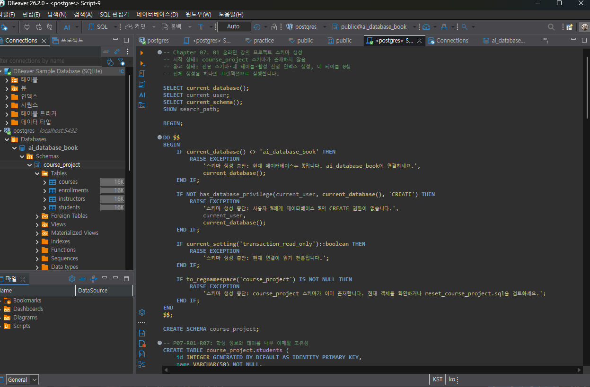
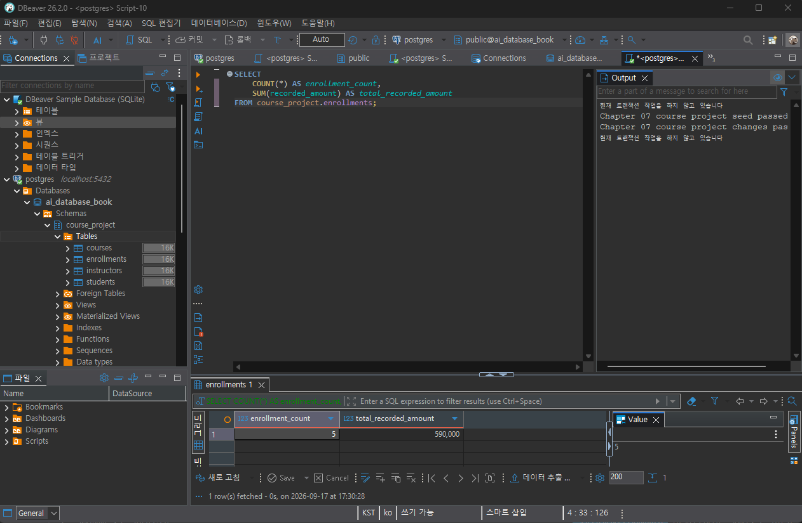
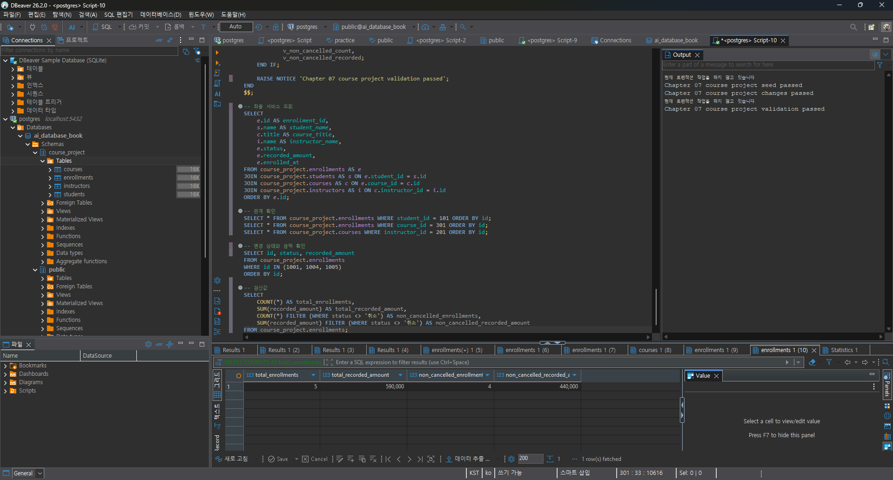
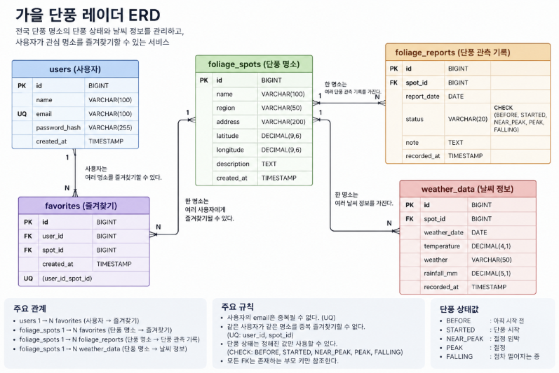

# Chapter 07 확장 실습 답안 템플릿

> **과제:** 실전 프로젝트 1 — 온라인 강의 수강신청 DB 완성하기  
> **사용 방법:** 이 파일을 내려받아 본인의 GitHub 저장소에 `chapter07_answer.md`라는 이름으로 저장한 뒤 실습하면서 바로 작성합니다.  
> **제출 방법:** LMS에는 파일을 직접 업로드하지 않고, **본인 GitHub 저장소의 `chapter07_answer.md` 파일 URL**을 제출합니다.

---

## 제출 전 주의

이 파일과 캡처 화면에는 실제 비밀번호, 전체 DB 접속 URL, API Key, 개인정보를 기록하지 않습니다.

```text
GitHub 계정 또는 별칭:
과제 작성일:2026-09-17
사용한 AI 도구:chatgpt
```

---

# 1. 시작 환경 확인

다음을 실행합니다.

```sql
SELECT current_database();
SELECT current_user;
SELECT current_schema();
SHOW search_path;
SHOW transaction_read_only;
```

| 확인 항목 | 실제 결과 | 의미 |
| --- | --- | --- |
| 확인 항목 | 실제 결과 | 의미 |
| --- | --- | --- |
| `current_database()` | `ai_database_book` | 현재 `ai_database_book` 데이터베이스에 연결되어 있다. |
| `current_user` | public | 현재 어떤 PostgreSQL 사용자 계정으로 접속했는지 확인했다. |
| `current_schema()` |ai_database_book| 현재 기본 스키마가 무엇인지 확인했다. |
| `search_path` |public, "$user"| PostgreSQL이 테이블을 찾을 때 확인하는 스키마 순서를 확인했다. |
| `transaction_read_only` |off| 현재 연결이 읽기 전용인지, 데이터 변경이 가능한지 확인했다. |

- [o] 현재 DB가 `ai_database_book`이다.
- [o] 쓰기 가능한 연결인지 확인했다.
- [o] 실행할 SQL 범위를 확인했다.
- [o] Auto-commit 상태를 확인했다.

### 프로젝트 SQL을 실행하기 전에 시작 상태를 확인해야 하는 이유

```text
SQL을 실행하기 전에 현재 어떤 데이터베이스와 사용자로 접속했는지,
데이터를 수정할 수 있는 상태인지 먼저 확인해야 한다.

잘못된 데이터베이스에 SQL을 실행하면
원하지 않는 테이블이나 데이터가 만들어질 수 있기 때문이다.

또한 Auto-commit 상태와 스키마 검색 경로를 확인하면
SQL 실행 결과를 더 정확하게 이해할 수 있다.
```

---

# 2. 프로젝트 범위와 요구사항 읽기

## 2-1. 포함 범위

본문을 그대로 복사하지 말고 자신의 말로 정리합니다.

```text
1. 학생과 강사의 기본 정보를 관리한다.
2. 강의 정보와 강의 가격을 관리한다.
3. 학생이 어떤 강의를 신청했는지 수강신청 정보를 기록한다.
4. 수강신청 상태와 신청 당시의 금액을 저장한다.
```

## 2-2. 제외 범위

```text
1. 실제 결제 승인, 결제 실패, 환불 기능은 다루지 않는다.
2. 강의 정원과 대기자 관리 기능은 다루지 않는다.
3. 강의 진도와 수료 여부는 관리하지 않는다.
4. 쿠폰이나 할인 이력은 관리하지 않는다.
```

### 범위를 명확하게 정해야 하는 이유

```text
프로젝트 범위를 미리 정하지 않으면
계속 새로운 기능을 추가하게 되어 DB 구조가 복잡해질 수 있다.

이번에 꼭 필요한 데이터와 아직 만들지 않을 기능을 구분하면
현재 학습 범위 안에서 정확하게 설계하고 검증할 수 있다.
```

## 2-3. 요구사항 / 프로젝트 결정 / 미확정 질문 구분

아래 항목 중 대표 항목을 정리합니다.

| ID | 종류 | 내용 요약 | DB 구조/규칙에 미치는 영향 |
| --- | --- | --- | --- |
| P07-R01 | 요구사항 |  |  |
| P07-R05 | 요구사항 |  |  |
| P07-R07 | 요구사항 |  |  |
| P07-D02 | 프로젝트 결정 |  |  |
| P07-D03 | 프로젝트 결정 |  |  |
| P07-Q01 | 미확정 질문 |  |  |

### 미확정 질문을 바로 제약조건으로 만들면 안 되는 이유

```text
아직 정책이 확정되지 않았는데 DB 제약조건으로 만들면
나중에 정책이 바뀌었을 때 구조를 다시 수정해야 할 수 있다.

따라서 미확정 질문은 먼저 확인하고,
확정된 내용만 DB 규칙으로 만들어야 한다.
```

---

# 3. 네 테이블의 한 행 의미와 관계

## 3-1. 한 행 의미

```text
course_project.students 한 행 = 학생 한 명

course_project.instructors 한 행 = 강사 한 명

course_project.courses 한 행 = 개설된 강의 한 개

course_project.enrollments 한 행 = 특정 학생이 특정 강의에 신청한 수강신청 한 건
```

## 3-2. 키와 중요 규칙

| 테이블 | PK | FK | 중요 규칙 |
| --- | --- | --- | --- |
| students |id|없음|이름·이메일·가입일 필수, 이메일 중복/공백 불가  |
| instructors | `id` | 없음 | 이름·이메일·전문분야 필수, 이메일 중복/공백 불가 |
| courses | `id` | `instructor_id` | 강사는 반드시 존재, 난이도 제한, 가격 0 이상 |
| enrollments | `id` | `student_id`, `course_id` | 상태 제한, 기록 금액 0 이상, 진행 중 중복 신청 금지 |


## 3-3. 관계를 양방향 문장으로 작성

```text
instructors ↔ courses:한 강사는 0개 이상의 강의를 담당할 수 있다.
한 강의는 정확히 한 강사를 참조한다.

students ↔ enrollments:한 학생은 0개 이상의 수강신청을 가질 수 있다.
한 수강신청은 정확히 한 학생을 참조한다.

courses ↔ enrollments:
한 강의는 0개 이상의 수강신청을 가질 수 있다.
한 수강신청은 정확히 한 강의를 참조한다.
```

### 학생과 강의의 N:M 관계가 `enrollments`를 통해 어떻게 바뀌는지 설명

```text
학생 한 명은 여러 강의를 신청할 수 있고 한 강의에도 여러 학생이 신청할 수 있으므로
학생과 강의는 N:M 관계이다.

이 관계를 enrollments가 받아 주면서
students 1:N enrollments N:1 courses 구조로 바뀐다.
```

### `enrollments`가 단순 연결 테이블이 아니라 사건 테이블이라고 볼 수 있는 이유

```text
enrollments에는 student_id와 course_id만 있는 것이 아니라
신청일, 상태, 신청 당시 기록 금액이 함께 저장된다.

따라서 단순 연결 정보가 아니라
실제 수강신청 사건 자체를 기록하는 테이블이다.
```

---

# 4. `recorded_amount`의 의미 이해

```text
courses.price = 현재 강의의 기준 가격

enrollments.recorded_amount = 수강신청이 만들어진 시점에 기록한 금액
```

### 두 값이 처음에는 같아도 같은 의미가 아닌 이유

```text
신규 수강신청이 만들어질 때는 현재 강의 가격인 courses.price 값을
recorded_amount에 기록한다.

하지만 나중에 강의 가격이 변경되더라도
과거 신청의 recorded_amount는 신청 당시 금액으로 남아 있어야 한다.

따라서 courses.price는 현재 가격이고,
recorded_amount는 신청 당시 기록된 가격이라는 차이가 있다.
```

### `recorded_amount`를 실제 결제 성공액이나 회계 매출로 해석하면 안 되는 이유

```text
현재 프로젝트에는 실제 결제 승인, 결제 실패, 환불 기능이 포함되어 있지 않다.

따라서 recorded_amount는 실제로 결제가 완료된 금액이 아니라
수강신청 당시 기록한 금액일 뿐이다.

그래서 실제 결제 성공액이나 회계 매출로 해석하면 안 된다.
```

---

# 5. STEP 01 — 스키마와 테이블 생성

실행 파일:

```text
code/chapter07/01_course_project_schema.sql
```

## 5-1. 실행 전 예상

```text
course_project 스키마 존재 여부: 생성될 것으로 예상
예상 테이블 수: 4개
예상 데이터 행 수: 0행
예상되는 명명 제약조건 수: 15개
예상되는 NOT NULL 열 수: 20개
부분 고유 인덱스 존재 여부: 존재
```

## 5-2. 실행 결과

```text
실제 테이블 수: 4개
실제 명명 제약조건 수: 15개
실제 NOT NULL 열 수: 20개
부분 고유 인덱스: uq_course_enrollments_active 존재
네 테이블의 실제 행 수: 모두 0행
통과 메시지: Chapter 07 course project schema creation passed
```

### 예상과 실제 비교

```text
실행 전 예상한 결과와 실제 결과가 일치했다.
course_project 스키마와 4개의 테이블이 정상적으로 생성되었고,
명명 제약조건, NOT NULL 열, 부분 고유 인덱스도 예상한 수와 동일했다.
또한 아직 Seed 데이터를 넣기 전이므로 네 테이블의 데이터는 모두 0행이었다.
```

### 증거 화면

권장 경로:

```text
assignments/chapter07/images/step05_schema.png
```



---

# 6. STEP 02 — Seed 데이터 입력

실행 파일:

```text
code/chapter07/02_course_project_seed.sql
```

## 6-1. 실행 전 예상

```text
students: 3
instructors: 2
courses: 3
enrollments: 4
recorded_amount 합계: 470000
학생 101 신청 건수: 2
강의 301 신청 건수: 2
강사 201 담당 강의 수: 2
활성 중복 신청: 0
```

## 6-2. 실제 결과

```text
students: 3
instructors: 2
courses: 3
enrollments: 4
recorded_amount 합계: 470000
학생 101 신청 건수: 2
강의 301 신청 건수: 2
강사 201 담당 강의 수: 2
활성 중복 신청: 0
1001 상태: 수강중
1004 상태: 신청
1005 존재 여부: 없음
통과 메시지: Chapter 07 course project seed passed
```

### Seed 데이터를 단순 예제가 아니라 검증 데이터라고 볼 수 있는 이유

```text
Seed 데이터는 단순히 예시 데이터를 넣는 것이 아니라
학생과 강의의 관계가 제대로 만들어졌는지,
같은 학생이나 강의에 여러 신청이 가능한지,
신청 상태와 기록 금액이 예상대로 저장되는지 확인하기 위한 기준 데이터이다.

따라서 이후 변경과 최종 검증 결과를 비교할 수 있는
기준 상태 역할을 한다.
```

---

# 7. STEP 03 — 변경 시나리오 실행

실행 파일:

```text
code/chapter07/03_course_project_changes.sql
```

## 7-1. 실행 전에 상태 변화를 예상

| 신청 ID | 변경 전 예상 상태 | 변경 후 예상 상태 | 예상 recorded_amount |
| ---: | --- | --- | ---: |
| 1001 | 수강중 | 완료 | 100000 |
| 1004 | 신청 | 취소 | 150000 |
| 1005 | 없음 | 신청 | 120000 |

```text
변경 후 예상 enrollments 행 수: 5
변경 후 예상 전체 recorded_amount 합계: 590000
변경 후 예상 취소 제외 건수: 4
변경 후 예상 취소 제외 recorded_amount 합계: 440000
```

## 7-2. 실제 결과

```text
1001 상태 / recorded_amount: 완료 / 100000
1004 상태 / recorded_amount: 취소 / 150000
1005 상태 / recorded_amount: 신청 / 120000
최종 enrollments 행 수: 5
전체 recorded_amount 합계: 590000
취소 제외 건수: 4
취소 제외 recorded_amount 합계: 440000
활성 중복 신청: 0
통과 메시지: Chapter 07 course project changes passed
```

### 조건부 UPDATE에서 예상 이전 상태를 확인해야 하는 이유

```text
UPDATE 전에 현재 상태가 내가 예상한 값인지 확인해야 한다.

예상과 다른 상태인데도 바로 수정하면
이미 다른 작업으로 변경된 데이터를 덮어쓸 수 있기 때문이다.

따라서 이전 상태를 확인한 뒤 조건에 맞는 경우에만 변경해야
데이터를 안전하게 수정할 수 있다.
```

### 증거 화면

권장 경로:

```text
assignments/chapter07/images/step07_changes.png
```



---

# 8. STEP 04 — 최종 완료 게이트 실행

실행 파일:

```text
code/chapter07/04_course_project_validation.sql
```

## 8-1. 최종 검증 결과

```text
최종 행 수 students/instructors/courses/enrollments: 3 / 2 / 3 / 5
서비스 JOIN 결과 행 수: 5
학생 101 신청 수: 2
강의 301 신청 수: 2
강사 201 강의 수: 2
고아 관계 수: 0
활성 중복 신청 수: 0
전체 recorded_amount: 590000
취소 제외 recorded_amount: 440000
통과 메시지: Chapter 07 course project validation passed
```

### SQL 파일 4개가 모두 실행되었다는 사실과 프로젝트 검증 PASS가 다른 이유

```text
SQL 파일 4개를 모두 실행했다는 것은
명령이 실행되었다는 사실만 의미한다.

하지만 프로젝트 검증 PASS는
최종 테이블 구조, 데이터 개수, 관계, 상태값, 금액 등이
예상한 기준과 요구사항을 실제로 만족하는지 확인했다는 뜻이다.

따라서 단순 실행 완료와 최종 검증 완료는 같은 의미가 아니다.
```

### 증거 화면

권장 경로:

```text
assignments/chapter07/images/step08_validation.png
```


---

# 9. 무결성 테스트

실행 파일:

```text
code/chapter07/05_course_project_integrity_tests.sql
```

> 오류 테스트는 파일 전체를 무작정 실행하지 않고 **한 테스트 구간씩** 실행합니다.

## 9-1. 허용되어야 하는 경계값 1개

```text
테스트 내용: 강의 가격에 0을 입력한다.
기대 결과: 정상적으로 허용된다.
실제 결과: 정상적으로 입력되었다.
왜 허용되어야 하는가: price 제약조건이 0 이상이므로 0은 허용되는 경계값이다.
```

## 9-2. 실패해야 하는 테스트 1 — 잘못된 참조 또는 값

```text
테스트 내용: 강의 가격에 음수를 입력한다.
기대 결과: 입력이 실패해야 한다.
실제 오류 핵심: CHECK 제약조건 위반
동작한 제약조건/규칙: chk_course_courses_price
왜 실패해야 하는가: 강의 가격은 0 이상이어야 하기 때문이다.
```

## 9-3. 실패해야 하는 테스트 2 — 활성 중복 신청

```text
테스트 내용: 같은 학생이 같은 강의에 '신청' 또는 '수강중' 상태로 다시 신청한다.
기대 결과: 중복 신청이 실패해야 한다.
실제 오류 핵심: 중복 키 또는 UNIQUE 인덱스 위반
동작한 인덱스/규칙: uq_course_enrollments_active
왜 실패해야 하는가: 진행 중인 같은 강의에 중복 신청할 수 없도록 설정했기 때문이다.
```

## 9-4. 실패 후 기준 상태 재검증

```text
04 validation 재실행 결과: Chapter 07 course project validation passed
기준 데이터가 유지되었는가: 예
```

### 실패 테스트가 프로젝트 품질 검증에 필요한 이유

```text
실패 테스트를 해야 DB 제약조건과 인덱스가 잘못된 데이터를 실제로 막는지 확인할 수 있다.
정상 데이터만 테스트하면 오류 상황에서 데이터가 안전하게 보호되는지 알 수 없기 때문이다.
```

### 증거 화면

권장 경로:

```text
assignments/chapter07/images/step09_integrity.png
```


---

# 10. 재현성 실험

> 이 단계는 본인의 실습 환경이며 보존할 데이터가 없을 때만 수행합니다.

실행 순서:

```text
reset_course_project.sql
→ 01_course_project_schema.sql
→ 02_course_project_seed.sql
→ 03_course_project_changes.sql
→ 04_course_project_validation.sql
```

```text
처음 실행의 최종 결과: Chapter 07 course project validation passed
재실행의 최종 결과: 선택 실습 미수행
두 결과가 일치했는가: 확인하지 않음
중간에 수동 수정이 필요했는가: 해당 없음
```

### 다른 사람이 같은 순서로 실행해 같은 결과를 얻는 것이 중요한 이유

```text
데이터베이스 프로젝트는 내 컴퓨터에서 한 번 실행되는 것만으로는 충분하지 않다.

다른 사람도 같은 SQL 파일을 같은 순서로 실행했을 때
동일한 테이블 구조와 기준 데이터가 만들어져야
프로젝트를 안정적으로 다시 만들 수 있기 때문이다.

이렇게 같은 결과를 다시 만들 수 있는 상태를 재현 가능하다고 볼 수 있다.
```

---

# 11. Chapter 01~06 개인 프로젝트를 중간 프로젝트 초안으로 확장

온라인 강의 예제를 이름만 바꾸지 않고 본인의 아이디어를 사용합니다.

## 11-1. 프로젝트 기본 정보

```text
프로젝트 이름: 가을 단풍 레이더

해결하려는 문제:
사용자가 현재 단풍이 어디까지 진행되었는지,
어느 지역이 절정인지 한눈에 확인하기 어려운 문제를 해결한다.

주요 사용자:
가을 단풍 명소를 찾는 여행객과 나들이를 계획하는 사용자
```

## 11-2. 포함 범위 / 제외 범위

```text
[포함]
1. 전국 단풍 명소의 기본 정보를 관리한다.
2. 각 명소의 현재 단풍 상태를 기록한다.
3. 단풍 시작일과 예상 절정일을 관리한다.
4. 명소별 날씨 및 단풍 관측 정보를 기록한다.

[제외]

1. 숙박이나 교통편의 실제 예약 및 결제 기능은 제외한다.
2. 사용자의 실시간 GPS 위치 추적 기능은 제외한다.
3. AI가 단풍 상태를 자동 판정하는 기능은 현재 범위에서 제외한다.
```

## 11-3. 요구사항

최소 8개를 작성합니다.

| ID | 요구사항 | 관련 테이블/관계 | 검증 방법 후보 |
| --- | --- | --- | --- |
| P07-MR01 | 단풍 명소는 이름과 지역 정보를 가진다. | foliage_spots | NOT NULL 확인 |
| P07-MR02 | 단풍 명소는 주소와 위도·경도 정보를 가질 수 있다. | foliage_spots | 조회 SQL |
| P07-MR03 | 단풍 상태는 정해진 상태값 중 하나여야 한다. | foliage_reports | CHECK 제약조건 |
| P07-MR04 | 단풍 관측 기록은 반드시 존재하는 명소를 참조한다. | foliage_reports → foliage_spots | FK 검증 |
| P07-MR05 | 단풍 관측일은 필수로 기록한다. | foliage_reports | NOT NULL 확인 |
| P07-MR06 | 날씨 정보는 해당 단풍 명소를 참조한다. | weather_data → foliage_spots | FK 검증 |
| P07-MR07 | 즐겨찾기는 사용자와 단풍 명소를 연결한다. | favorites → users, foliage_spots | FK 검증 |
| P07-MR08 | 같은 사용자가 같은 명소를 중복 즐겨찾기할 수 없다. | favorites | UNIQUE 검증 |
## 11-4. 프로젝트 결정

최소 3개를 작성합니다.

| ID | 이번 프로젝트에서 내린 결정 | 이유 | 구현 후보 |
| --- | --- | --- | --- |
| P07-MD01 | 단풍 상태는 정해진 5단계로 관리한다. | 상태 표현을 통일하기 위해 | CHECK |
| P07-MD02 | 같은 사용자는 같은 단풍 명소를 한 번만 즐겨찾기할 수 있다. | 중복 데이터를 막기 위해 | UNIQUE(user_id, spot_id) |
| P07-MD03 | 단풍 관측 기록은 덮어쓰지 않고 날짜별로 보관한다. | 과거 단풍 변화도 확인할 수 있게 하기 위해 | foliage_reports 별도 테이블 |

## 11-5. 미확정 질문

최소 3개를 작성합니다.

```text
P07-MQ01. 한 명소의 단풍 상태를 하루에 여러 번 기록할 수 있도록 할 것인가?

P07-MQ02. 사용자가 직접 단풍 상태를 제보할 수 있도록 할 것인가?

P07-MQ03. 오래된 날씨와 단풍 기록을 얼마나 오래 보관할 것인가?
```

---

# 12. 개인 프로젝트 ERD와 한 행 의미

## 12-1. 테이블 후보

최소 4개를 권장합니다.

| 테이블 | 한 행의 의미 | PK 후보 | FK 후보 | 주요 규칙 |
| --- | --- | --- | --- | --- |
| foliage_spots | 단풍 명소 한 곳 | id | 없음 | 이름·지역 필수 |
| foliage_reports | 특정 명소의 특정 시점 단풍 관측 한 건 | id | spot_id | 명소 필수, 상태값 제한 |
| weather_data | 특정 명소의 날짜별 날씨 정보 한 건 | id | spot_id | 명소 필수, 관측일 필수 |
| users | 사용자 한 명 | id | 없음 | 이메일 필수·중복 금지 |
| favorites | 사용자가 특정 명소를 즐겨찾기한 한 건 | id | user_id, spot_id | 사용자+명소 중복 금지 |

## 12-2. 관계 문장

```text
1. 한 단풍 명소는 여러 개의 단풍 관측 기록을 가질 수 있고,
   하나의 단풍 관측 기록은 정확히 한 단풍 명소를 참조한다.

2. 한 단풍 명소는 여러 날짜의 날씨 정보를 가질 수 있고,
   하나의 날씨 정보는 정확히 한 단풍 명소를 참조한다.

3. 한 사용자는 여러 단풍 명소를 즐겨찾기할 수 있고,
   한 단풍 명소도 여러 사용자에게 즐겨찾기될 수 있다.
   따라서 users와 foliage_spots의 N:M 관계를 favorites가 연결한다.
```

## 12-3. ERD

권장 이미지 경로:

```text
assignments/chapter07/images/personal_project_erd.png
```



### Chapter 05~06 ERD에서 이번에 바꾼 점

```text
기존에는 단풍 명소와 사용자 중심으로만 생각했지만,
이번에는 단풍 관측 기록과 날씨 정보를 별도 테이블로 나누었다.

또한 즐겨찾기 테이블을 추가해서
사용자와 단풍 명소의 N:M 관계를 표현했다.

같은 사용자가 같은 명소를 중복 즐겨찾기하지 못하도록
UNIQUE 규칙을 고려했고,
단풍 상태도 정해진 값만 사용할 수 있도록 CHECK 규칙을 추가했다.
```

---

# 13. 개인 프로젝트 완료 기준 만들기

“잘 동작한다”처럼 모호하게 쓰지 말고 검증 가능한 기준을 최소 6개 작성합니다.

| 번호 | 완료 기준 | 자동 SQL 검증 가능? | 검증 방법 |
| ---: | --- | --- | --- |
| 1 | users, foliage_spots, foliage_reports, weather_data, favorites 테이블이 모두 존재한다. | 가능 | `to_regclass()` 또는 `information_schema.tables` 조회 |
| 2 | 존재하지 않는 단풍 명소를 참조하는 foliage_reports 행이 0건이다. | 가능 | FK 및 고아 관계 조회 |
| 3 | 허용되지 않은 단풍 상태값을 입력하면 DB가 거부한다. | 가능 | CHECK 제약조건 테스트 |
| 4 | 같은 사용자가 같은 단풍 명소를 두 번 즐겨찾기하면 DB가 거부한다. | 가능 | UNIQUE 제약조건 테스트 |
| 5 | Seed 데이터 입력 후 각 테이블의 행 수가 예상값과 일치한다. | 가능 | `COUNT(*)` 조회 |
| 6 | 최종 validation SQL을 실행했을 때 모든 기준을 만족하고 PASS 결과가 나온다. | 가능 | validation SQL 실행 |

예시 형식:

```text
Seed 실행 후 A/B/C/D 테이블의 행 수가 각각 5/3/8/12다.
존재하지 않는 부모를 참조하는 행은 0건이다.
허용되지 않은 상태 입력은 DB가 거부한다.
검증 SQL이 예상 결과를 반환한다.
```

---

# 14. AI를 프로젝트 리뷰어로 사용

AI에게 프로젝트를 대신 완성시키지 않고 누락과 위험을 찾게 합니다.

## 14-1. AI에게 전달한 핵심 자료

```text
요구사항:
단풍 명소 정보, 단풍 관측 기록, 날씨 정보, 사용자 즐겨찾기 정보를 관리해야 한다.

테이블/ERD 설명:
foliage_spots, foliage_reports, weather_data, users, favorites 테이블로 구성했다.

프로젝트 결정:
단풍 상태는 정해진 값만 사용하고,
같은 사용자가 같은 명소를 중복 즐겨찾기하지 못하게 하며,
단풍 관측 기록은 날짜별로 보관하기로 했다.

미확정 질문:
하루에 같은 명소를 여러 번 관측할 수 있는지,
사용자 제보 기능을 넣을지,
오래된 관측 기록을 얼마나 보관할지는 아직 확정하지 않았다.

완료 기준:
테이블 존재, FK 무결성, 상태값 제한, 중복 즐겨찾기 차단,
Seed 행 수 검증, validation PASS를 기준으로 정했다.
```

## 14-2. 내가 사용한 프롬프트

```text
나는 데이터베이스 입문 수업의 중간 프로젝트 초안을 작성하고 있습니다.

아래 프로젝트를 대신 완성하지 말고 리뷰어로 검토해 주세요.

특히 다음을 확인해 주세요.

1. 요구사항과 ERD가 연결되지 않는 부분
2. 한 행의 의미가 섞인 테이블
3. 빠진 PK/FK 관계
4. 근거 없이 추가한 UNIQUE / NOT NULL / CHECK
5. 미확정 정책을 임의로 확정한 부분
6. Seed 데이터로 검증하기 어려운 요구사항
7. 자동 검증하기 어려운 완료 기준

정답 ERD나 전체 SQL을 먼저 작성하지 말고
문제점과 확인 질문을 우선순위 순으로 알려 주세요.
```

## 14-3. AI 제안 검토

| AI 제안 | 수용 / 수정 / 보류 / 거절 | 실제 근거 | 반영 내용 |
| --- | --- | --- | --- |
| favorites에 사용자+명소 중복 방지 UNIQUE를 두자 | 수용 | 중복 즐겨찾기는 필요하지 않음 | UNIQUE(user_id, spot_id) 후보로 반영 |
| 단풍 상태는 CHECK로 제한하자 | 수용 | 정해진 상태값만 사용하기로 결정함 | CHECK 제약조건 후보로 반영 |
| 사용자 제보 이력 테이블을 추가하자 | 보류 | 현재 요구사항에 포함되지 않음 | 향후 확장 기능으로 보류 |
| 오래된 관측 기록 자동 삭제 기능을 넣자 | 거절 | 보관 기간 정책이 아직 미확정 | 현재 프로젝트에서는 구현하지 않음 |

### AI가 미확정 정책을 임의로 확정하려 한 부분이 있었나요?

```text
사용자 제보 기능과 오래된 기록 삭제 정책처럼
아직 정하지 않은 내용을 구현 규칙으로 제안한 부분이 있었다.
그래서 바로 반영하지 않고 보류하거나 거절했다.
```

### AI가 제안한 규칙 중 아직 배우지 않은 기능이라 보류한 것이 있나요?

```text
자동 삭제나 복잡한 이력 관리 기능은 현재 학습 범위를 넘어가므로 보류했다.
```

### AI 활용 후 실제로 좋아진 부분

```text
요구사항과 ERD가 서로 연결되는지 다시 확인할 수 있었고,중복 데이터와 미확정 정책을 구분해서 생각하게 되었다.
```

---

# 15. 최종 성찰

아래 문장은 반드시 본인의 말로 작성합니다.

```text
1. 데이터베이스 프로젝트가 완료되었다고 판단하려면
   SQL 파일의 존재보다 요구사항대로 구조와 데이터가 만들어지고 검증되는 것이 중요하다.

2. Seed 데이터의 목적은 단순히 화면을 채우는 것이 아니라
   관계와 상태값, 금액, 제약조건이 제대로 동작하는지 확인하는 기준 데이터를 만드는 것이다.

3. 실패 테스트가 필요한 이유는
   잘못된 데이터가 들어왔을 때 DB가 실제로 차단하는지 확인하기 위해서이다.

4. 요구사항과 프로젝트 결정을 구분해야 하는 이유는
   반드시 지켜야 하는 규칙과 이번 프로젝트에서 선택한 규칙을 혼동하지 않기 위해서이다.

5. 내가 만든 개인 프로젝트에서 가장 먼저 추가 확인해야 할 정책은
   한 명소의 단풍 상태를 하루에 여러 번 기록할 수 있는지에 대한 기준이다.
```

---

# 16. 제출 체크리스트

- [ ] `chapter07_answer.md`를 본인 저장소에 만들었다.
- [ ] 시작 환경과 현재 DB를 확인했다.
- [ ] 프로젝트 포함/제외 범위를 설명했다.
- [ ] 요구사항/결정/미확정 질문을 구분했다.
- [ ] 네 테이블의 한 행 의미와 관계를 설명했다.
- [ ] `01_course_project_schema.sql`을 실행하고 결과를 확인했다.
- [ ] `02_course_project_seed.sql`의 기준 상태를 확인했다.
- [ ] `03_course_project_changes.sql` 전후 상태를 비교했다.
- [ ] `04_course_project_validation.sql` PASS를 확인했다.
- [ ] 허용 경계값 1개 이상을 확인했다.
- [ ] 실패 테스트 2개 이상을 한 구간씩 실행했다.
- [ ] 실패 후 validation을 다시 실행했다.
- [ ] 개인 프로젝트 요구사항 8개 이상을 작성했다.
- [ ] 프로젝트 결정 3개 이상과 미확정 질문 3개 이상을 작성했다.
- [ ] 개인 프로젝트 ERD를 작성했다.
- [ ] 검증 가능한 완료 기준 6개 이상을 작성했다.
- [ ] AI 제안을 수용/수정/보류/거절로 구분했다.
- [ ] 핵심 캡처는 3~4장 정도로 정리했다.
- [ ] 캡처에 비밀번호나 개인정보가 없다.
- [ ] GitHub 웹에서 Markdown과 이미지가 정상적으로 보인다.
- [ ] 최종 파일을 commit/push했다.

---

# 17. LMS 제출 URL

아래 형식의 **본인 GitHub 파일 URL**을 LMS에 제출합니다.

```text
https://github.com/<본인-GitHub-ID>/<본인-저장소>/blob/main/assignments/chapter07/chapter07_answer.md
```

내 제출 URL:

```text

```

> 저장소 메인 URL, 교수자 템플릿 URL, Raw URL이 아니라 **작성 완료된 본인 `chapter07_answer.md` 파일 화면 URL**을 제출합니다.
